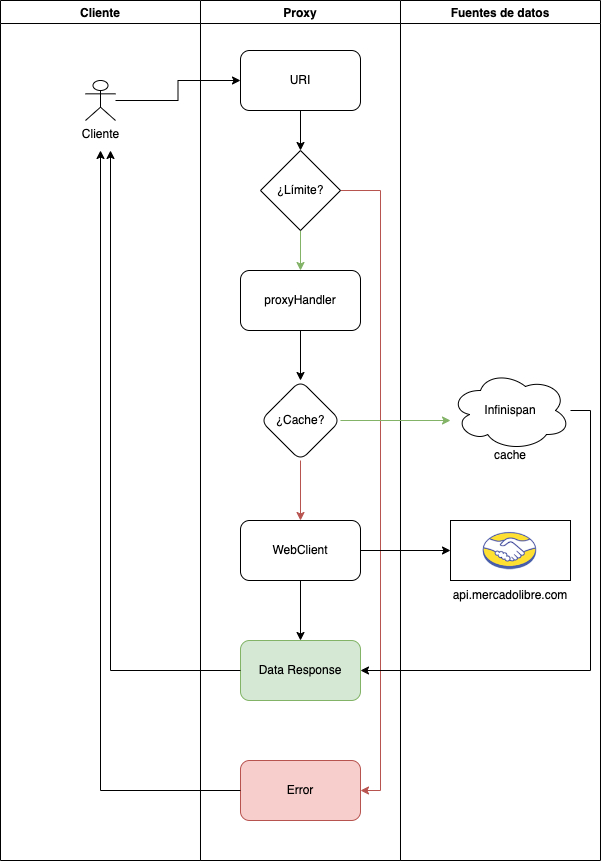
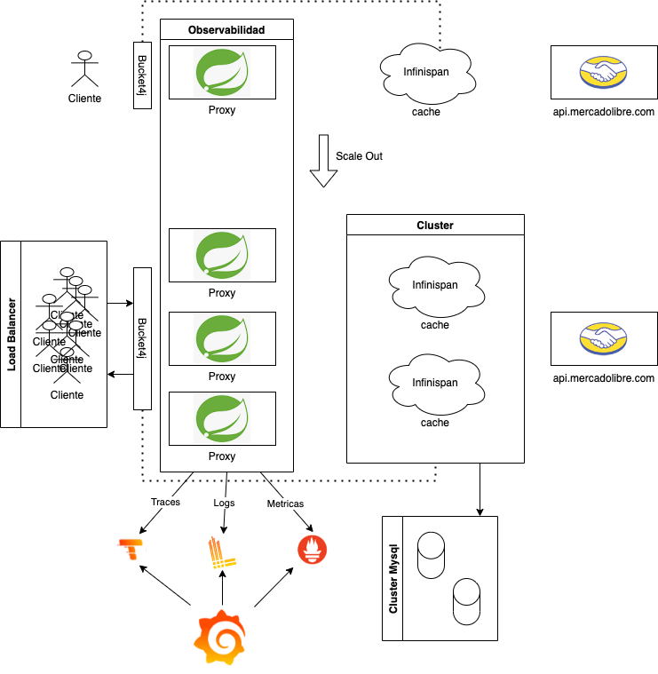

# Challenge Meli Proxy
Esta es una solución propuesta con opción de alta disponibilidad para un proxy con la API mercadolibre.

## Stack Utilizado

### Proxy:
- Spring Boot 3, Spring Framework 5.
- Opción de compilación nativa con GraalVM.

### Cache:
- Infinispan

### Observabilidad:
- Tempo.
- Loki.
- Prometheus.
- Grafana.

### Rate Limit:
- Bucket4j.

## Diagrama de Flujo

## Escalabilidad
Para asegurar una escalabilidad óptima se utilizará un balanceador de carga, además de aprovechar las opciones de regionalización de las nubes disponibles.
De esta manera podemos agregar más pods dependiendo de dónde procedan las solicitudes.
La estrategia de escalamiento debe considerar un límite de 85% de uso de CPU para comenzar con la generación de nuevos Pods. 

Para asegurar que toda la aplicación sea resiliente a fallos, se utiliza la característica de clusterización de Infinispan, opcionalmente se puede almacenar la data en un cluster MySQL, para asegurar aún más el rescate de la infomación en caso de falla crítica.

También se proveerá de una escalabilidad descendente para reducir la cantidad de Pods disponibles en el momento en que la carga comience a disminuir.

## Cache
Para proporcionar una solución de respuesta rápida, se implementa Infinispan como método de cacheo de información.
Este sistema está basado en motores Java y es muy eficiente al momento de integrarlo con aplicaciones que operan sobre esta misma tecnología.
Adicionalmente, es escalable, se puede clusterizar y es resiliente a fallos. Se puede integrar con fuentes de datos externas para asegurar la persistencia de la información.

## Rate Limit
Para controlar el rate limit por peticiones, se utiliza la librería Bucket4j. Esta librería trabaja por tokens, los cuales son asignados por petición que ingresa al sistema. 
Se puede administrar la configuración mientras la aplicación se está ejecutando. Y se puede integrar con Infinispan para asegurar el filtrado incluso cuando se escala la aplicación.

## Observabilidad
Se utiliza el stack completo de Grafana para la observabilidad y obtener estadísticas de uso de nuestro Proxy.
El stack utilizado es Loki, para obtención de logs; Tempo, para tracing; Prometheus, para monitorización de salud, y Grafana para visualizar la información en un sistema User Friendly.

